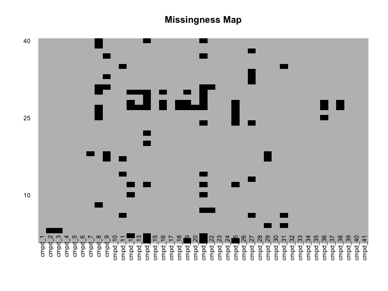
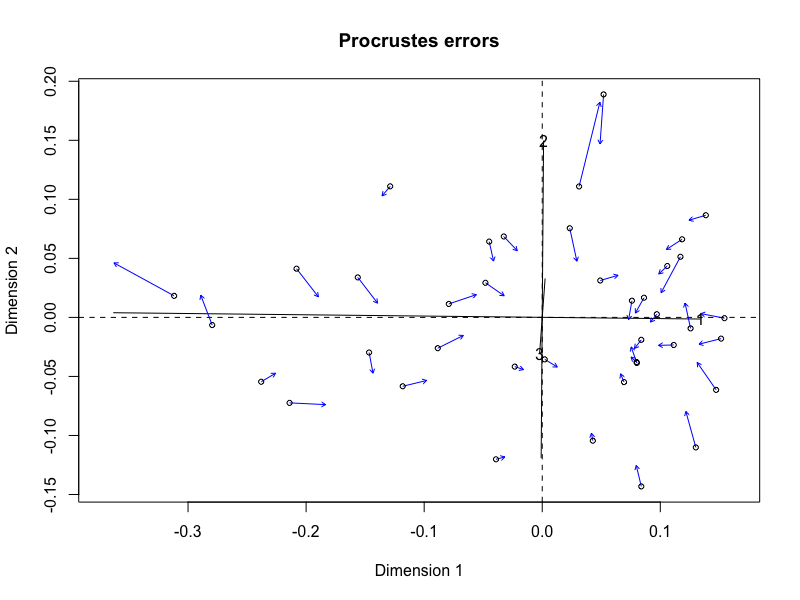
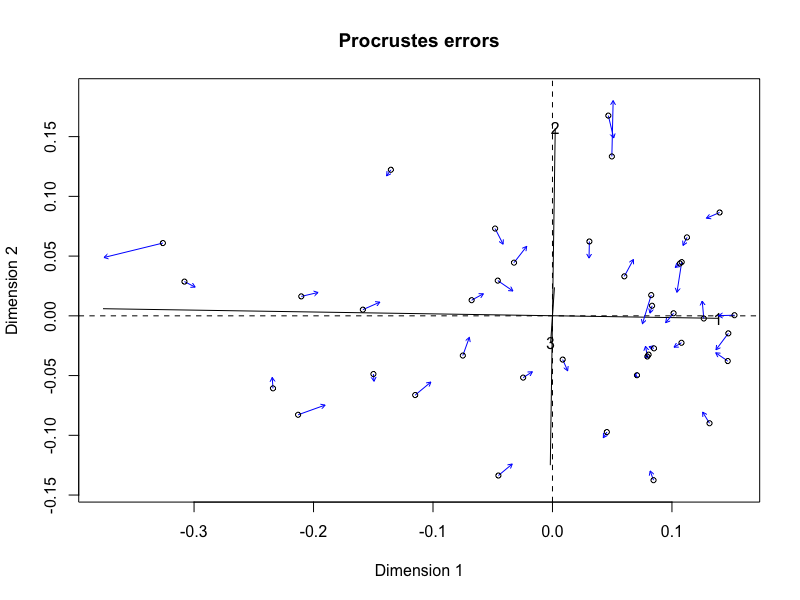
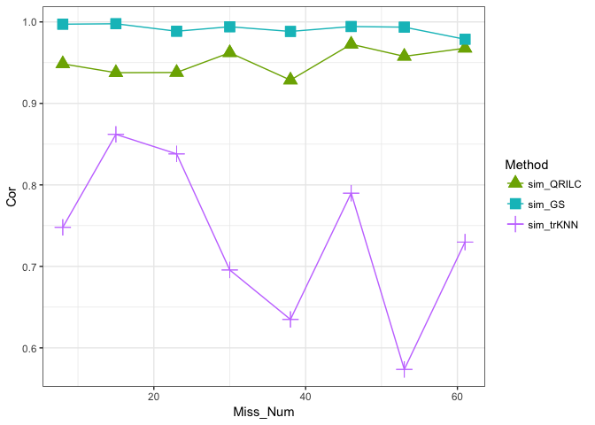
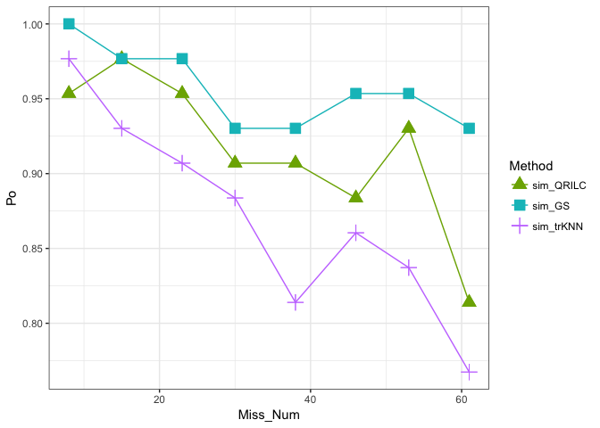

# A Quick Tour of GSimp

# 1. Introduction

GSimp is a gibbs sampler based left-censored missing value imputation
approach for metabolomics studies. This vignette provides a quick tour
of GSimp that contains, data pre-processing, simulated data generation,
missing not at random (MNAR) generation, wrapper functions for different
MNAR imputation methods (GSimp, QRILC, and kNN-TN) and evaluations of
these methods. Core functions for GSimp and the real-world metabolomics
datasets are available at: [GitHub](https://github.com/WandeRum/GSimp).
All content of GSimp is licensed under the [Creative Commons
Attribution-NonCommercial-ShareAlike 4.0 International
License](https://creativecommons.org/licenses/by-nc-sa/4.0/).

Please cite our paper once it is published: Wei, R., Wang, J., Jia, E.,
Chen, T., Ni, Y., & Jia, W. (2017). GSimp: A Gibbs sampler based
left-censored missing value imputation approach for metabolomics
studies. PLOS Computational Biology (under revision).

**GSimp.R** contains the core functions for GSimp.

**GSimp_evaluation.R** contains MNAR generation and evaluation functions which are part of our missing value imputation evaluation pipeline.

**Impute_wrapper.R** contains wrapper functions for different imputation methods (contains *pre_processing_GS_wrapper*).

**MVI_global.R** contains some basic global functions.

**Prediction_funcs.R** contains wrapper functions for different prediction models.

**simulation_generation.Rmd** contains a simulation dataset generation algorithm.

**simulation_generation.pdf** was knited by **simulation_generation.Rmd**.

**real_data.csv** is a real-world targeted metabolomics dataset contains both FFAs and BAs.

**data_sim.csv** is the simulated dataset (details could be found in **simulation_generation.Rmd**).

**targeted_data.csv** is a targeted LC/MS data with missing values.

**untargeted_data.csv** is an untargeted GC/MS data with missing values after manually missing retrieval.

**Trunc_KNN** contains kNN-TN algorithm and related functions developed by Jasmit S. Shah (https://doi.org/10.1186/s12859-017-1547-6).

**vignette_files** contains files for README.md.

# 2. Preparation
## 2.1 Packages and source code importing
--------------------------------

``` r
options(stringsAsFactors = F)
source('Trunc_KNN/Imput_funcs.r')
source('GSimp_evaluation.R')
source('GSimp.R')
```

Package Dependencies and Version

| Package      | Version    |
|:-------------|:-----------|
| Amelia       | 1.7.4      |
| abind        | 1.4-5      |
| doParallel   | 1.0.11     |
| FNN          | 1.1        |
| foreach      | 1.4.4      |
| ggplot2      | 2.2.1.9000 |
| glmnet       | 2.0-13     |
| impute       | 1.50.1     |
| imputeLCMD   | 2          |
| knitr        | 1.17       |
| magrittr     | 1.5        |
| markdown     | 0.8        |
| missForest   | 1.4        |
| pheatmap     | 1.0.8      |
| randomForest | 4.6-12     |
| reshape2     | 1.4.3      |
| ropls        | 1.8.0      |
| vegan        | 2.4-5      |


## 2.2 Data Pre-processing

In GSimp, we recommend data pre-processing steps as following:

-   Log-transformation (for non-normal data)
-   Initialization for missing values (e.g., QRILC)
-   Centralization and scaling (for elastic-net prediction)
-   Imputation using GSimp
-   Scaling recovery
-   Exponential recovery
-   Imputed data output

All aboved steps has been wrapped into the
*pre\_processing\_GS\_wrapper* function for a one-step processing and
imputation. The function will give the final imputed dataset.

``` r
# wrapper function with data pre-processing
pre_processing_GS_wrapper <- function(data) {
  data_raw <- data
  # Log transformation #
  data_raw_log <- data_raw %>% log()
  # Initialization #
  data_raw_log_qrilc <- impute.QRILC(data_raw_log) %>% extract2(1)
  # Centralization and scaling #
  data_raw_log_qrilc_sc <- scale_recover(data_raw_log_qrilc, method = 'scale')
  # Data after centralization and scaling #
  data_raw_log_qrilc_sc_df <- data_raw_log_qrilc_sc[[1]]
  # Parameters for centralization and scaling (for scaling recovery) #
  data_raw_log_qrilc_sc_df_param <- data_raw_log_qrilc_sc[[2]]
  # NA position #
  NA_pos <- which(is.na(data_raw), arr.ind = T)
  # NA introduced to log-scaled-initialized data #
  data_raw_log_sc <- data_raw_log_qrilc_sc_df
  data_raw_log_sc[NA_pos] <- NA
  # Feed initialized and missing data into GSimp imputation #
  result <- data_raw_log_sc %>% GS_impute(., iters_each=50, iters_all=10, 
                                             initial = data_raw_log_qrilc_sc_df,
                                             lo=-Inf, hi= 'min', n_cores=2,
                                             imp_model='glmnet_pred')
  data_imp_log_sc <- result$data_imp
  # Data recovery #
  data_imp <- data_imp_log_sc %>% 
    scale_recover(., method = 'recover', 
                  param_df = data_raw_log_qrilc_sc_df_param) %>% 
    extract2(1) %>% exp()
  return(data_imp)
}
```

# 3. GSimp in a nutshell

The function *GS\_impute* is the core function for the imputation of
missing data and tracing the Gibbs sampler with certain missing
positions.

Some arguments of *GS\_impute*:

-   **iters\_each** is the number of iterations for imputing each
    missing variable (default=100).

-   **iters\_all** is the number of iterations for imputing the whole
    data matrix (default=20).

-   Although a large number of iterations (e.g., iters\_all=20 and
    iters\_each=100) is recommended for the convergence of MCMC, a smaller
    number of iterations (iters\_all=10, iters\_each=50) won’t severely
    affect the imputation accuracy as we tested on the simulation data.

-   **initial** is the initialization method for missing values
    (default=‘qrilc’). We provided three ways: ‘lsym’, ‘qrilc’, ‘rsym’.
    ‘lsym’ will draw samples from the right tail of the distribution and
    symmetrically transformed to the left tail; ‘rsym’ will draw samples
    from the left tail of the distribution and symmetrically transformed
    to the right tail, this is for the right-censored missing; ‘qrilc’
    will use QRILC imputed values as initial. An pre-initilized data
    frame is also acceptable for this argument.

-   **lo** is the lower limits (default=‘-Inf’) and **hi**
    (default=‘min’) is the upper limits for missing values. These two
    arguments can be defined as -Inf/Inf/‘min’/‘max’/‘median’/‘mean’ or
    any single determined value or a vector of values (same length with number
    of variables, the values of non-missing vairables won’t affect
    results). Here, lo=-Inf, hi=‘min’ are default setting for
    left-censored missing values where the upper bound is set to the
    minimum value of non-missing part (notably, quantile values can be
    applied if minimum is too strict. For example, hi=sapply(data,
    function(x) quantile(x, .1, na.rm=T)) represent the 10% quantiles of
    each variable are set to the upper bounds). When non-informative
    bounds for both upper and lower limits (e.g., +∞, -∞) were applied,
    GSimp could be extended to the situation of MCAR/MAR.

-   **n\_cores** is the number of cores for computing (parallel
    computing will impute all missing variables simultaneously while
    non-parallel computing will impute missing variables sequentially
    from the least number of missings to the most).

-   **gibbs** is the missing elements you want to trace across the whole
    MCMC (default=data.frame(row=integer(), col=integer())). This
    argument must be set as the positions of missing elements. For
    example, gibbs=data.frame(row=c(1, 3), col=c(2, 5)) represent you
    want to trace the missing elements in row 1 column 2 and row 3
    column 5.

Outputs of *GS\_impute*:

-   **data\_imp** is the imputed data frame.

-   **gibbs\_res** is a three dimensional array that records the whole
    process of specified missing elements across MCMC iterations. The
    first dimension represents std/yhat/yres which stands for the
    stadard deviation/predicted value/sampling value. The second
    dimension represents missing elements you specified and the third
    dimension represents the iterations.

## 3.1 GSimp in real-world missing data sets
### 3.1.1 Data sets

The untargeted GC/MS dataset contains 37 samples and 112 variables with
317 missing elements and 221 of them were retrieved manually. From the following
kernel density plot, we found overlaps between
non-missing values and retrieved missing values. Thus, we assumed that the 
majority of missingness in untargeted GC/MS-based metabolomics data are 
MCAR/MAR. The targeted LC/MS dataset contains 40 samples and 41 variables with 88
missing elements are failed to be quantified due to LOQ/LOD.


The following analyses are tested on post-missing retrieval untargeted GC/MS dataset and targted LC/MS dataset.

### 3.1.2 Other Wrapper functions

We compared GSimp with other left-censored missing
imputation/substitution methods:

-   QRILC (Quantile Regression Imputation of Left-Censored data) imputes
    missing elements randomly drawing from a truncated distribution
    estimated by a quantile regression. Function impute.QRILC in R
    package imputeLCMD was applied for this imputation approach. The
    function *sim\_QRILC\_wrapper* was used in this method.

-   kNN-TN (Truncation k-nearest neighbors imputation) applied a
    Newton-Raphson (NR) optimization to estimate the truncated mean and
    standard deviation. Then, Pearson correlation was calculated based
    on standardized data followed by correlation-based kNN imputation.
    kNN-TN algorithm and related functions developed by Jasmit S. Shah
    (<https://doi.org/10.1186/s12859-017-1547-6>) was used for this
    imputation approach. The function *sim\_trKNN\_wrapper* was used in
    this method.

-   HM (Half of minimum) replace missingness with half of the minimum of
    the variable.

``` r
# QRILC
sim_QRILC_wrapper <- function(data, ...) {
  result <- data %>%  impute.QRILC(., ...) %>% extract2(1)
  return(result)
}

# trKNN
sim_trKNN_wrapper <- function(data) {
  result <- data %>% as.matrix %>% t %>% imputeKNN(., k=3, distance='truncation', 
                                                   perc=0) %>% t
  return(result)
}

# HM
sim_HM_wrapper <- function(data) {
  result <- data
  result[] <- lapply(result, function(x) {
    x[is.na(x)] <- min(x, na.rm = T)/2
    x
  })
  return(result)
}
```

### 3.1.3 Imputation comparison

#### 3.1.3.1 Untargeted GC/MS dataset

``` r
# load dataset
untargeted_data <- read.csv('untargeted_data.csv', row.names=1)
missmap(untargeted_data, col=c("black", "grey"), legend=FALSE)
```


Each black cell represents a missing value.

``` r
# record positions of missing values 
NA_pos <- which(is.na(untargeted_data), arr.ind = T)
col_na <- NA_pos[, 2]

# imputations
set.seed(123)
after_GS_imp <- pre_processing_GS_wrapper(untargeted_data)
```

    ## Iteration 1 start...Parallel computing (n_cores=2)...end!
    ## Iteration 2 start...Parallel computing (n_cores=2)...end!
    ## Iteration 3 start...Parallel computing (n_cores=2)...end!
    ## Iteration 4 start...Parallel computing (n_cores=2)...end!
    ## Iteration 5 start...Parallel computing (n_cores=2)...end!
    ## Iteration 6 start...Parallel computing (n_cores=2)...end!
    ## Iteration 7 start...Parallel computing (n_cores=2)...end!
    ## Iteration 8 start...Parallel computing (n_cores=2)...end!
    ## Iteration 9 start...Parallel computing (n_cores=2)...end!
    ## Iteration 10 start...Parallel computing (n_cores=2)...end!

``` r
data_raw_log <- untargeted_data %>% log()
after_trKNN_imp <- sim_trKNN_wrapper(data_raw_log) %>% data.frame() %>% exp()
after_QRILC_imp <- sim_QRILC_wrapper(data_raw_log) %>% exp()
after_HM_imp <- sim_HM_wrapper(untargeted_data)

# NRMSE and PCA procruste comparisons
imp_list <- list()
imp_list[[1]] <- after_GS_imp[,col_na] %>% log()
imp_list[[2]] <- after_trKNN_imp[,col_na] %>% log()
imp_list[[3]] <- after_QRILC_imp[,col_na] %>% log()
imp_list[[4]] <- after_HM_imp[,col_na] %>% log()
method_names <- c('GSimp', 'trKNN', 'QRILC', 'HM')

# NRMSE Results
NRMSE_res <- NRMSE_list(imp_list, untargeted_data, method_names)
NRMSE_res <- round(NRMSE_res, digits = 3)
kable(NRMSE_res)
```

NRMSE between imputation methods

|       |  GSimp|  trKNN|  QRILC|     HM|
|-------|------:|------:|------:|------:|
| GSimp |     NA|  2.175|  1.272|  1.674|
| trKNN |  2.175|     NA|  2.995|  3.918|
| QRILC |  1.272|  2.995|     NA|  1.361|
| HM    |  1.674|  3.918|  1.361|     NA|

``` r
# PCA procrustes results
PCA_res <- PCA_pro_list(imp_list, nPCs=3, method_names)
procrustes_df <- round(PCA_res$pro_ss_df, digits = 3)
kable(procrustes_df)
```
PCA Procrustes results between imputation methods

|       |  GSimp|  trKNN|  QRILC|     HM|
|-------|------:|------:|------:|------:|
| GSimp |     NA|  0.119|  0.018|  0.029|
| trKNN |  0.119|     NA|  0.136|  0.214|
| QRILC |  0.018|  0.136|     NA|  0.031|
| HM    |  0.029|  0.214|  0.031|     NA|

``` r
plot(PCA_res$pro_res$trKNN_GSimp)
```


PCA-Procrustes between GSimp (points) and kNN-TN (targets)


``` r
plot(PCA_res$pro_res$QRILC_GSimp)
```


PCA-Procrustes between GSimp (points) and QRILC (targets)


``` r
plot(PCA_res$pro_res$HM_GSimp)
```


PCA-Procrustes between GSimp (points) and HM (targets)


#### 3.1.3.2 Targeted LC/MS dataset

``` r
targeted_data <- read.csv('targeted_data.csv', row.names=1)
missmap(targeted_data, col=c("black", "grey"), legend=FALSE)
```


Each black cell represents a missing value.

```r
# record positions of missing values 
NA_pos <- which(is.na(targeted_data), arr.ind = T)
col_na <- unique(NA_pos[, 2])

# imputations
set.seed(123)
after_GS_imp <- pre_processing_GS_wrapper(targeted_data)
```

    ## Iteration 1 start...Parallel computing (n_cores=2)...end!
    ## Iteration 2 start...Parallel computing (n_cores=2)...end!
    ## Iteration 3 start...Parallel computing (n_cores=2)...end!
    ## Iteration 4 start...Parallel computing (n_cores=2)...end!
    ## Iteration 5 start...Parallel computing (n_cores=2)...end!
    ## Iteration 6 start...Parallel computing (n_cores=2)...end!
    ## Iteration 7 start...Parallel computing (n_cores=2)...end!
    ## Iteration 8 start...Parallel computing (n_cores=2)...end!
    ## Iteration 9 start...Parallel computing (n_cores=2)...end!
    ## Iteration 10 start...Parallel computing (n_cores=2)...end!

``` r
data_raw_log <- targeted_data %>% log()
after_trKNN_imp <- sim_trKNN_wrapper(data_raw_log) %>% 
  data.frame() %>% exp()
after_QRILC_imp <- sim_QRILC_wrapper(data_raw_log) %>% exp()
after_HM_imp <- sim_HM_wrapper(targeted_data)

# NRMSE and PCA procruste comparisons
imp_list <- list()
imp_list[[1]] <- after_GS_imp[,col_na] %>% log()
imp_list[[2]] <- after_trKNN_imp[,col_na] %>% log()
imp_list[[3]] <- after_QRILC_imp[,col_na] %>% log()
imp_list[[4]] <- after_HM_imp[,col_na] %>% log()
method_names <- c('GSimp', 'trKNN', 'QRILC', 'HM')


# NRMSE results
NRMSE_res <- NRMSE_list(imp_list, targeted_data, method_names)
NRMSE_res <- round(NRMSE_res, digits = 3)
kable(NRMSE_res)
```

NRMSE between imputation methods


|       |  GSimp|  trKNN|  QRILC|     HM|
|-------|------:|------:|------:|------:|
| GSimp |     NA|  2.005|  1.403|  1.085|
| trKNN |  2.005|     NA|  1.628|  2.449|
| QRILC |  1.403|  1.628|     NA|  1.222|
| HM    |  1.085|  2.449|  1.222|     NA|

``` r
# PCA procrustes results
PCA_res <- PCA_pro_list(imp_list, nPCs=3, method_names)
procrustes_df <- round(PCA_res$pro_ss_df, digits = 3)
kable(procrustes_df)
```

PCA Procrustes results between imputation methods


|       |  GSimp|  trKNN|  QRILC|     HM|
|-------|------:|------:|------:|------:|
| GSimp |     NA|  0.171|  0.094|  0.029|
| trKNN |  0.171|     NA|  0.051|  0.113|
| QRILC |  0.094|  0.051|     NA|  0.039|
| HM    |  0.029|  0.113|  0.039|     NA|

``` r
plot(PCA_res$pro_res$trKNN_GSimp)
```


PCA-Procrustes between GSimp (points) and kNN-TN (targets)


``` r
plot(PCA_res$pro_res$QRILC_GSimp)
```



PCA-Procrustes between GSimp (points) and QRILC (targets)


``` r
plot(PCA_res$pro_res$HM_GSimp)
```



PCA-Procrustes between GSimp (points) and HM (targets)


## 3.2 GSimp in simulated data sets
### 3.2.1 Simulated dataset generation

For the simulation dataset, we first calculated the covariance matrix
Cov based on the whole diabetes dataset (*P*=76) where *P* represents the
number of variables. Then we generated two separated data matrices with
the same number of 80 observations from multivariate normal
distributions, representing two different biological groups. For each
data matrix, the sample mean of each variable was drawn from a normal
distribution *N*(0, 0.5^2^) and *Cov* was kept using SVD. Then, two data
matrices were horizontally (column-wise) stacked together as a complete
data matrix (*N*×*P*=160×76) so that group differences were simulated and
covariance was kept.

```r
data_sim <- read.csv('data_sim.csv', row.names=1)
data_sim_sc <- scale(data_sim)
```

```r
group <- rep(c(0, 1), each=80) %>% as.factor
sim_pvals <- apply(data_sim_sc, 2, function(x) t.test(x ~ group)$p.value)
```

```
# P-values for two groups on simulation dataset is:
# 7.746669e-11 1.963778e-01 8.522196e-06 9.885971e-02 1.165720e-01 
5.295838e-06 5.510601e-01 3.338875e-06 1.934161e-04 1.385230e-01 ...
```

### 3.2.2 Imputation comparison

First, we generated a series of MNAR datasets by using the missing
proportion from 0.1 to 0.8 step by 0.1 with MNAR cut-off drawn from
*U*(0.3, 0.6). Then, GSimp, QRILC, and kNN-TN was used to impute MNAR
datasets, respectively.

``` r
# Simply package GSimp into a wrapper function which requires no data preprocessing 
considering how we generated the simulation data

sim_GS_wrapper <- function(data) {
  result <- data %>% GS_impute(., iters_each=50, iters_all=10, initial='qrilc', 
                                  lo=-Inf, hi='min', n_cores=2, imp_model='glmnet_pred')
  return(result$data_imp)
}

# a list of MNAR datasets generation and imputation with different imputation wrapper functions
sim_MNAR_list <- MNAR_gen_imp(data_c=data_sim_sc, mis_var_prop=seq(.1, .8, .1), 
                              var_mis_prop=seq(.3, .6, .1), 
                              impute_list=c('sim_QRILC_wrapper', 'sim_GS_wrapper', 
                                            'sim_trKNN_wrapper'), cores=1)
# cores should be 1 in MNAR_gen_imp function, since sim_GS_wrapper() use multiple cores
```

Unlabeled measurements include the NRMSE-based sum of ranks (SOR),
principal component analysis (PCA)-Procrustes analysis while labeled
measurements include correlation analysis for univariate results,
partial least square (PLS)-Procurstes analysis.

``` r
## SOR calculation and plot
sim_MNAR_NRMSE_rank_list <- NRMSE_rank_cal_plot(sim_MNAR_list, plot=T, x='Miss_Num', 
                                                colors=c('#7CAE00', '#00BFC4', '#C77CFF'), 
                                                shapes=c(17, 15, 3))
```


SOR of three imputation methods with the increasing number of missing variables


``` r
## PCA-Procrustes and plot
sim_MNAR_PCA_ProSS_list <- Procrustes_cal_plot(sim_MNAR_list, DR='PCA', nPCs=2, x='Miss_Num', 
                                               plot=T, 
                                               colors=c('#7CAE00', '#00BFC4', '#C77CFF'), 
                                               shapes=c(17, 15, 3))
```


PCA-Procrustes results of three imputation methods with the increasing number of missing variables


``` r
## PLS-Procrustes and plot
sim_MNAR_PLS_ProSS_list <- Procrustes_cal_plot(sim_MNAR_list, DR='PLS', nPCs=2, outcome=group, 
                                               x='Miss_Num', plot=T, 
                                               colors=c('#7CAE00', '#00BFC4', '#C77CFF'), 
                                               shapes=c(17, 15, 3))
```


PLS-Procrustes results of three imputation methods with the increasing number of missing variables


``` r
## T-test correlation and plot
sim_MNAR_Ttest_Cor_list <- Ttest_cor_cal_plot(sim_MNAR_list, group=group, plot=T, x='Miss_Num', 
                                              cor='P', 
                                              colors=c('#7CAE00', '#00BFC4', '#C77CFF'), 
                                              shapes=c(17, 15, 3))
```



Correlation of T-test p-values of three imputation methods with the increasing number of missing variables


``` r
## TPR calculation and plot
sim_MNAR_Ttest_TPR_list_2 <- Ttest_P_cal_plot(impute_results=sim_MNAR_list, group=group, 
                                                plot=T, p_cut=.05, x = 'Miss_Num', 
                                                colors=c('#7CAE00', '#00BFC4', '#C77CFF'), 
                                                shapes=c(17, 15, 3))
```


TPR (p-value=.05) of three imputation methods with the increasing number of missing variables


``` r
sim_MNAR_Ttest_TPR_list_3 <- Ttest_P_cal_plot(impute_results=sim_MNAR_list, group=group, 
                                                plot=T, p_cut=.01, x = 'Miss_Num', 
                                                colors=c('#7CAE00', '#00BFC4', '#C77CFF'), 
                                                shapes=c(17, 15, 3))
```



TPR (p-value=.01) of three imputation methods with the increasing number of missing variables


## 3.3 GSimp with different iterations

Since GSimp employed an iterative Gibbs sampler method, a large number
of iterations (iters\_all=20, iters\_each=100) are preferable for the
convergence of parameters estimation. However, as we tested on the simulation
dataset with different number of iterations (iters\_each=50 and
iters\_all=20, iters\_each=100 and iters\_all=20, iters\_each=50 and
iters\_all=10, iters\_each=100 and iters\_all=10), a much less
iterations won’t severely affect the imputation accuracy.

``` r
GSimp_50_20_wrapper <- function(data) {
  result <- data %>% GS_impute(., iters_each=50, iters_all=20, initial='qrilc', 
                                  lo=-Inf, hi='min', 
                                  n_cores=2, imp_model='glmnet_pred')
  return(result$data_imp)
}

GSimp_100_20_wrapper <- function(data) {
  result <- data %>% GS_impute(., iters_each=100, iters_all=20, initial='qrilc', 
                                  lo=-Inf, hi='min', 
                                  n_cores=2, imp_model='glmnet_pred')
  return(result$data_imp)
}

GSimp_50_10_wrapper <- function(data) {
  result <- data %>% GS_impute(., iters_each=50, iters_all=10, initial='qrilc', 
                                  lo=-Inf, hi='min', 
                                  n_cores=2, imp_model='glmnet_pred')
  return(result$data_imp)
}

GSimp_100_10_wrapper <- function(data) {
  result <- data %>% GS_impute(., iters_each=100, iters_all=10, initial='qrilc', 
                                  lo=-Inf, hi='min', 
                                  n_cores=2, imp_model='glmnet_pred')
  return(result$data_imp)
}
```

``` r
GSimp_iters_MNAR_list <- MNAR_gen_imp(data_c=data_sim_sc, mis_var_prop=seq(.2, .5, .1), 
                                      var_mis_prop=seq(.1, .5, .1), 
                                      impute_list=c('GSimp_50_20_wrapper', 
                                                    'GSimp_100_20_wrapper', 
                                                    'GSimp_50_10_wrapper', 
                                                    'GSimp_100_10_wrapper'), 
                                      cores=1)
# cores should be 1 in MNAR_gen_imp function, since GS_impute() use multiple cores
```

``` r
GSimp_iters_MNAR_NRMSE_rank_list <- NRMSE_rank_cal_plot(GSimp_iters_MNAR_list, 
                                                        plot=T, x='Miss_Num')
```


SOR of different interations of GSimp with the increasing number of missing variables


# 4. Concluding remarks

GSimp is a convenient software for the imputation of left-censored MNAR data. With
proper modifications (e.g., truncation points (**lo** and **hi**), pre-processing approaches), GSimp can be applicable
to handle different types of missingness (e.g., right-censored MNAR, MCAR, MAR) and different types of -omics
studies, which is deserved to be further explored in the future.
